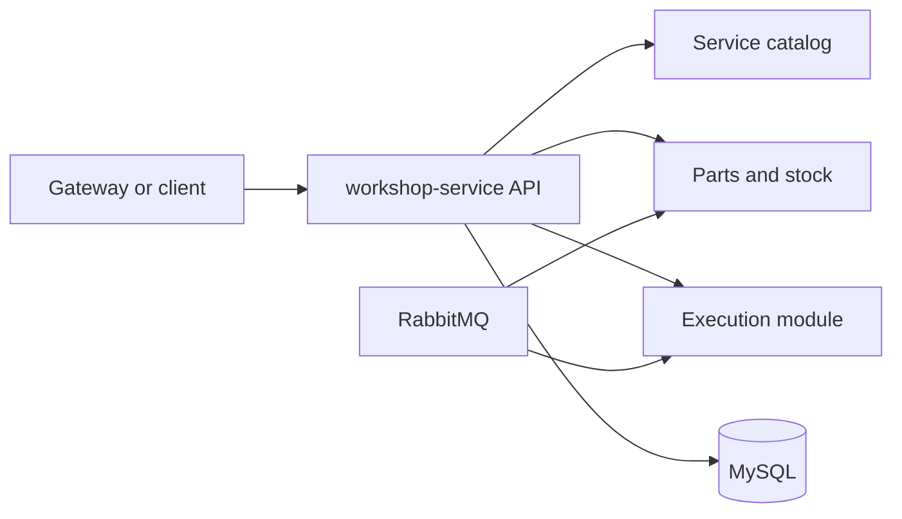

# Workshop Service

`workshop-service` owns service catalog, parts inventory, stock reservation and
release, plus the execution queue and execution state transitions.

## Responsibility

- service catalog CRUD
- parts and stock operations
- stock reservation and observable stock release
- execution queue and execution lifecycle
- workshop-side messaging for stock and execution

This service owns its own MySQL database and does not access the databases of
other services.

## Technology

- NestJS
- TypeORM
- MySQL
- RabbitMQ messaging
- Swagger
- Prometheus `/metrics`
- JSON logs with `correlationId`
- Dockerfile and Docker Compose
- Kubernetes manifests
- Sonar configuration

## Architecture



## Data Ownership

- owned database: MySQL
- owned aggregates: service catalog items, parts, stock reservations, stock release operations, executions, consumed message ledger
- no cross-service database access

## Main API Groups

Swagger is the reference for the full contract:

- local Swagger URL: `http://localhost:3000/docs`
- route groups:
  - `service-catalog`
  - `parts`
  - `executions`
  - `platform`

## Execution Module

Execution states:

- `QUEUED`
- `IN_DIAGNOSIS`
- `IN_REPAIR`
- `FINISHED`
- `FAILED`

`QUEUED` entries form the local execution queue.

## Published Events

- `stock.reserved`
- `stock.reservation.failed`
- `stock.released`
- `stock.release.failed`
- `execution.started`
- `execution.finished`
- `execution.failed`

## Consumed Events

- `stock.reserve.requested`
- `stock.release.requested`
- `execution.requested`

## Environment Variables

See `.env.example` for the safe local template.

Key variables:

- `DB_HOST`
- `DB_PORT`
- `DB_USERNAME`
- `DB_PASSWORD`
- `DB_DATABASE`
- `DB_SSL`
- `JWT_SECRET`
- `JWT_ISSUER`
- `JWT_AUDIENCE`
- `MESSAGING_ENABLED`
- `CONSUMED_MESSAGE_LEASE_MS`
- `METRICS_ENABLED`

Do not commit real secrets.

## Local Execution

```bash
npm ci
npm run start:dev
```

Local supporting assets:

- `Dockerfile`
- `docker-compose.yml`

## Migrations

```bash
npm run migration:run
npm run migration:run:prod
npm run migration:revert
```

## Tests And Validation

```bash
npm run format
npm run lint
npm run build
npm test -- --runInBand
npm run test:cov
docker compose --env-file .env.example config
kubectl kustomize k8s
```

Jest enforces `80%` minimum for statements, branches, functions and lines.

## CI/CD

Workflow files:

- `.github/workflows/ci.yml`
- `.github/workflows/cd.yml`

CI validates lint, build, coverage, Docker build, Kubernetes render and Sonar.

CD is configured for:

- `homologation` -> GitHub Environment `homologation`
- `main` -> GitHub Environment `production`

This README documents pipeline configuration only. It does not claim a hosted
deployment was executed from this workspace.

## Kubernetes

This repository contains service-local manifests under `k8s/`:

- `Deployment`
- `Service`
- `ConfigMap`
- `Secret` template
- `HorizontalPodAutoscaler`

Local render:

```bash
kubectl kustomize k8s
```

## Observability

- `/metrics`
- JSON logs
- readiness `/ready`
- liveness `/health`
- execution duration metric by status
- integration failure metric via adapters

## External Dependencies

- MySQL
- RabbitMQ
- JWT issued by `auth-function`

## Delivery Evidence

- repository URL: `PENDING`
- homologation URL: `PENDING`
- latest successful CI run: `PENDING`
- quality gate: `PENDING`
- coverage evidence: `96.16% statements, 88.48% branches, 93.68% functions, 96.32% lines (local artifact); hosted link/print PENDING`
- branch protection: `PENDING VERIFICATION`
- Swagger hosted URL: `PENDING`

## External Evidence Status

- hosted repository and Swagger URLs: `PENDING`
- branch protection and environments: `PENDING VERIFICATION`
- no deploy was executed from this workspace
